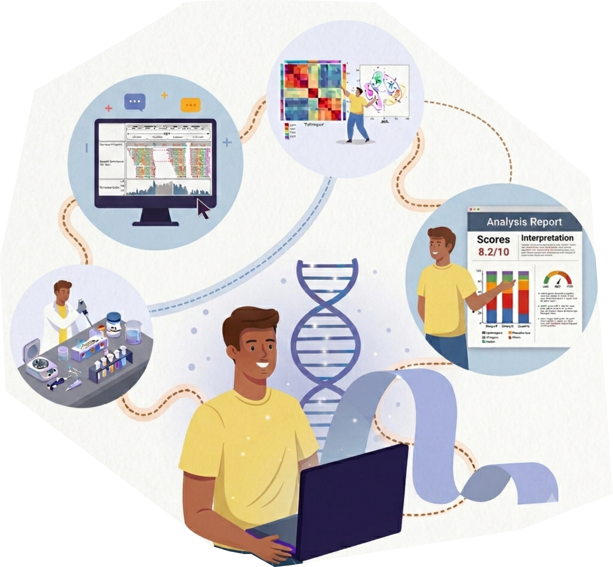
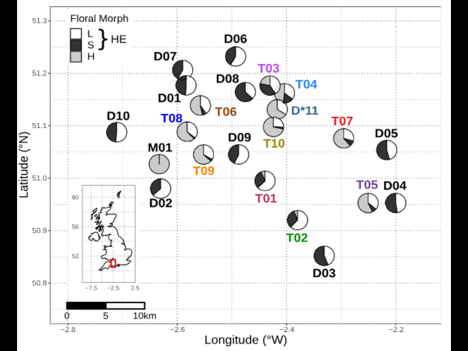

## Hi there, I'm Emiliano 👋

  Computational Biologist | Bioinformatician | Data Scientist

#### Visit my personal [page](https://emilianomora.github.io/)!

---

## GitHub Stats

  
  

## Languages

## Some of my figures

